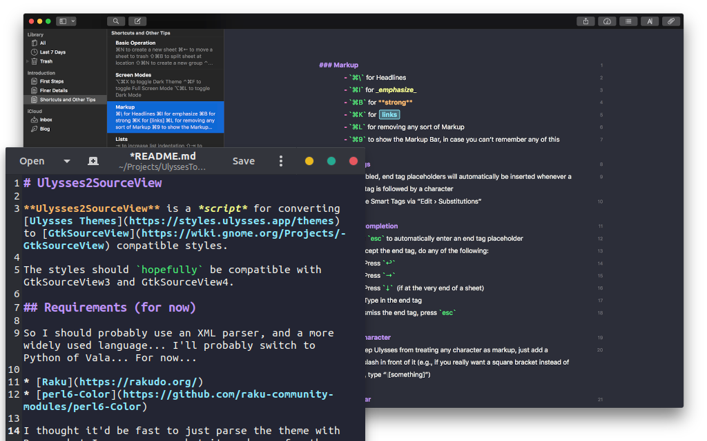

# ultheme Parser for Vala



Port of [Ulysses2SourceView](https://github.com/kmwallio/Ulysses2SourceView) in Vala Library form. With a few fixes and a few more bugs.

Allows you to convert [Ulysses Editor Themes](https://styles.ulysses.app/themes) to [GtkSourceView Style Schemes](https://wiki.gnome.org/Projects/GtkSourceView/StyleSchemes).

## Requirements

```
valac
libarchive-dev
libclutter-dev
libxml2-dev
```

## Usage

### vala-ultheme.wrap
```
[wrap-git]
directory=vala-ultheme
url=https://github.com/TwiRp/ultheme-vala.git
revision=master
```

Place the `vala-ultheme.wrap` in subprojects directory in your project.

In your meson.build, add:

```
ultheme_dep = dependency('vala-ultheme-0.1', fallback : [ 'vala-ultheme', 'libultheme_dep' ])
```

Then add ultheme_dep to your dependencies.