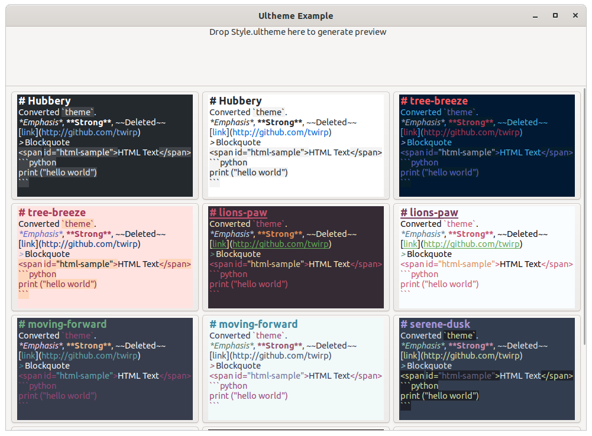

# ultheme Parser for Vala



Port of [Ulysses2SourceView](https://github.com/kmwallio/Ulysses2SourceView) in Vala Library form. With a few fixes and a few more bugs.

Allows you to convert [Ulysses Editor Themes](https://styles.ulysses.app/themes) to markdown syntax focused [GtkSourceView Style Schemes](https://wiki.gnome.org/Projects/GtkSourceView/StyleSchemes).

## Requirements

```
valac
libarchive-dev
libclutter-1.0-dev
libxml2-dev
```

## Usage

### ultheme.wrap
```
[wrap-git]
directory=vala-ultheme
url=https://github.com/TwiRp/ultheme-vala.git
revision=master
```

Place the `ultheme.wrap` in subprojects directory in your project.

In your meson.build, add:

```
ultheme_dep = dependency('ultheme-0.1', fallback : [ 'ultheme', 'libultheme_dep' ])
gxml_dep = dependency('gxml-0.18', fallback : [ 'gxml', 'libgxml_dep' ])
```

Then add ultheme_dep, gxml_dep, and dependency('clutter-1.0') to your dependencies.

### Parsing a Theme

Download desired theme from [Ulysses Editor Themes](https://styles.ulysses.app/themes).

Themes contain both a light and dark version. To get the dark version, you can do:

```vala
public static int main (string[] args) {
    var ultheme = new Ultheme.Parser (File.new_for_path (args[1]));
    print (ultheme.get_dark_theme ());

    return 0;
}
```

For the light version:

```vala

public static int main (string[] args) {
    var ultheme = new Ultheme.Parser (File.new_for_path (args[1]));
    print (ultheme.get_light_theme ());

    return 0;
}
```

There's bugs and magic numbers. This is a best guess implementation.
